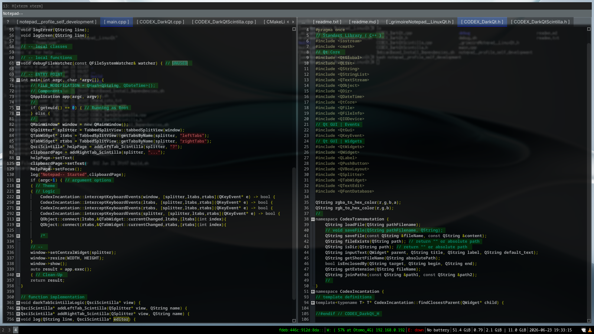

# Notepad-- (Linux)

This is a linux version of [Notepad--](https://github.com/EYO-07/Notepad--) written in **c++** and using **Qt6 Framework** and **QsciScintilla** port of **Scintilla** for **Qt**. A slop and much lesser version of **Notepad++**, don't like it? Use **Notepad++** instead. This project should work well with Debian-based and Arch-based linux distributions.

## Features--
1. Fixed Dark Theme. I don't care about your bad taste, it's hardcoded.
2. Has less language support. Just use a normal programming language, like a normal person.
3. Lot of commands using keyboard shortcuts instead of a proper user interface. Never played a game? Are u a boomer?  
4. No internet connection needed, no auto-update.

## Actual Features:
1. Translucent Minimalist Dark Theme.
2. Syntax Highlighting and Special Text Marker Highlighting for custom keywords.
3. Autocompletion.

## Installation and Usage

For further installation and usage, read the `readme.txt`.
